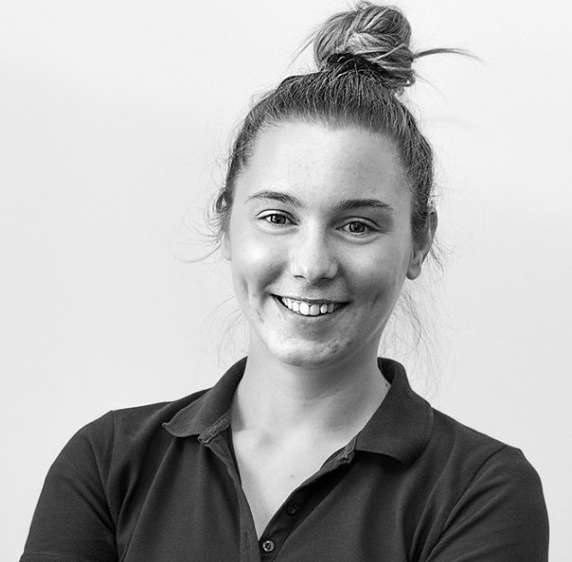

<h2>Vision and goals</h2>

Main purpose of Cypress South-East Europe is to create a community of testers and developers in this part of the world, in order to make knowledge sharing easier.
Besides social media pages, we will be hosting local and regional meetups (more information soon).

Anyone willing to help and participate is more than welcome to do so!

<h2>Team</h2>

  

   <h4 style="text-align:center">Bojan Jevtić(Co-founder)</h4>
   
  

  

     QA Analyst and automation enthusiast located in Belgrade, Serbia.
      bojan@cypress-see.com
  

  

    
  

 

 

   

    <h4 style="text-align:center">Tamara Popov (Co-founder)</h4>
    
  

  

      QA Analyst and big cypress fan located in Belgrade, Serbia.
      tamara@cypress-see.com
  

  

    
  

